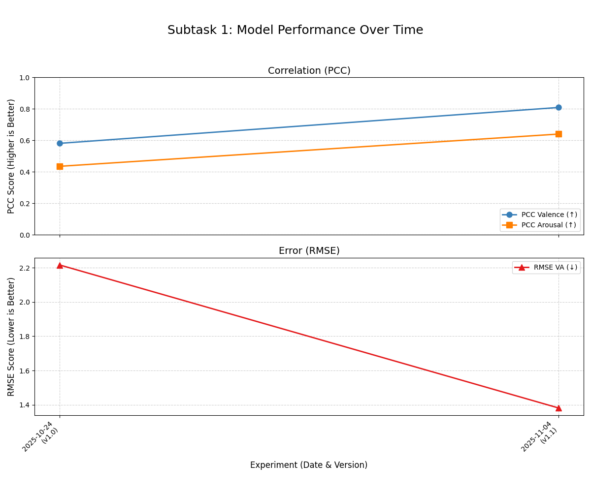

# HCC_dimABSA
Exploring Aspect-based sentiment analysis with continuous emotion scores (Valence &amp; Arousal) – Bachelor-level implementation of SemEval2026.

## Model Performance Progress

This chart shows the performance improvement on the **dev set** over time.

*Note: All experiments are run with a global random seed of 42 to ensure fair and reproducible comparisons.*

## Experiment Log & Results

This table tracks the performance of each model version on the **dev set**.

| Date | Experiment | Model | PCC_V (↑) | PCC_A (↑) | RMSE_VA (↓) | Notes |
| :--- | :--- | :--- | :---: | :---: | :---: | :--- |
| 24.10.25 | v1.0 | `bert-base-multilingual-cased` | 0.581 | 0.435 | 2.216 | Initial run. |
| 04.11.25 | v1.1 | `bert-base-multilingual-cased` | **0.809** | **0.640** | **1.381** | **Fixed tokenizer mismatch.** |
| 09.11.25 | v1.2 | `bert-base-multilingual-cased` | **0.8119** | **0.6567** | **1.5626** | **Implemented early stopping mechanism.** |
